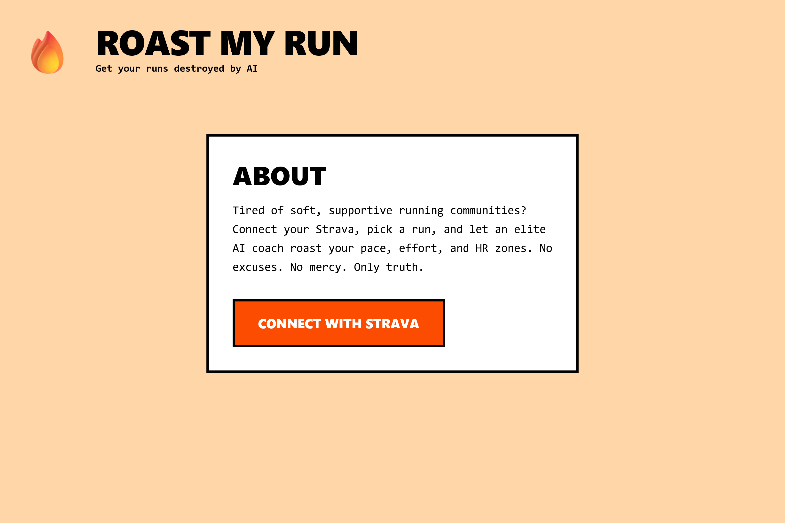
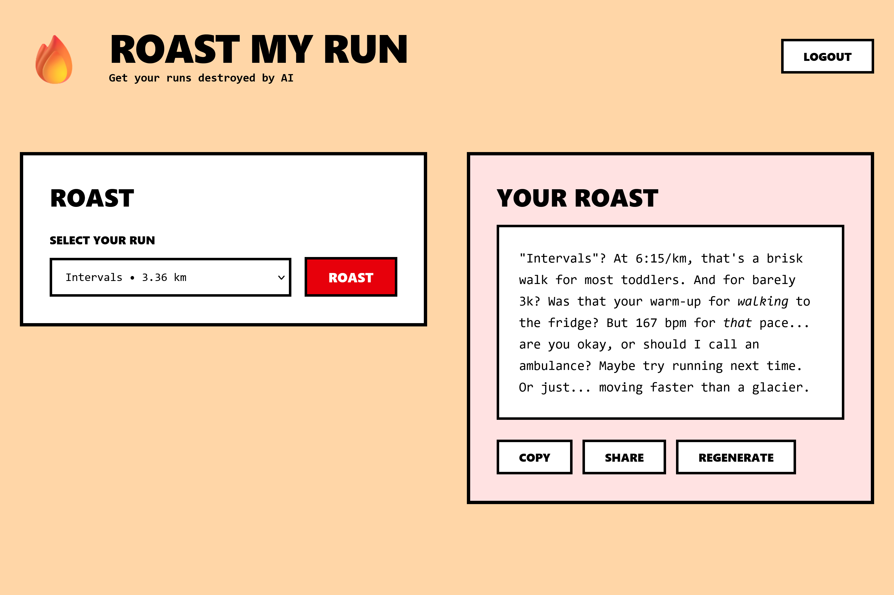

# 🔥 Roast My Run

Get hilarious AI-generated roasts of your running activities. Connect your Strava account, let Google Gemini analyze your runs, and get roasted for your efforts.

> **Try it live:** [roast-my-run.javierferrersb.dev](https://roast-my-run.javierferrersb.dev) _(due to Gemini API's rate limits, the live demo may be temporarily unavailable)_

## Features

- **Strava Integration** - Seamlessly connect your Strava account via OAuth
- **AI-Powered Roasts** - Google Gemini generates personalized, witty roasts of your activities
- **Activity Selection** - Browse and select from your recent running activities
- **Clean UI** - Modern, responsive design that works on all devices

## Screenshots




## Quick Start

### Prerequisites

- Node.js 18+
- pnpm
- [Strava API credentials](https://www.strava.com/settings/api)
- [Google Gemini API key](https://ai.google.dev)

See [SETUP.md](docs/SETUP.md) for detailed API configuration instructions.

### Installation

1. **Clone and install**

```bash
git clone <repository-url>
cd roast-my-run
pnpm install
```

2. Configure environment variables

Create `.env.local` and add:

```env
NEXT_PUBLIC_STRAVA_CLIENT_ID=<your-strava-client-id>
STRAVA_CLIENT_SECRET=<your-strava-secret>
GEMINI_API_KEY=<your-gemini-api-key>
```

3. Run development server

```bash
pnpm dev
```

Open [http://localhost:3000](http://localhost:3000) in your browser.

## Build for Production

```bash
pnpm build
pnpm start
```

## License

MIT
